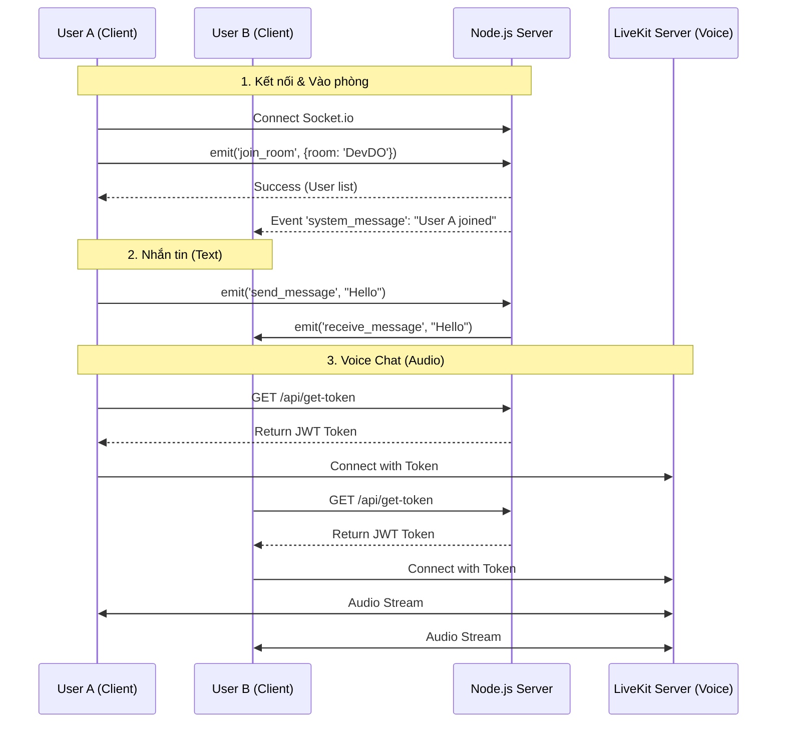

# Anonymous Chat - Technical Deep Dive & Presentation Guide

## 1. Giới thiệu Dự án (Project Overview)

**Anonymous Chat** là một ứng dụng nhắn tin thời gian thực (Real-time Messaging Application) tập trung vào sự riêng tư và ẩn danh. Không cần đăng ký tài khoản, không lưu trữ lịch sử tin nhắn lâu dài (Zero Footprint), và hỗ trợ chat voice chất lượng cao.

Dự án được xây dựng với kiến trúc hiện đại, tách biệt rõ ràng giữa Client (Frontend) và Server (Backend), sử dụng WebSocket cho giao tiếp tức thời.

### Công nghệ cốt lõi (Technology Stack):

- **Frontend**: React (Vite), TailwindCSS.
- **Backend**: Node.js, Express.
- **Real-time Communication**: Socket.io (WebSocket wrapper).
- **Voice Streaming**: LiveKit (WebRTC SFU).
- **Deployment**: Vercel (Frontend), Render/Glitch (Backend).

---

## 2. Cơ chế WebSocket (Chủ đề Thầy hay hỏi)

### 2.1. WebSocket là gì?

Khác với giao thức HTTP truyền thống (Client hỏi -> Server trả lời -> Ngắt kết nối), **WebSocket** cung cấp một kênh giao tiếp hai chiều (Full-duplex) liên tục giữa Client và Server qua một kết nối TCP duy nhất.

- **HTTP**: Request/Response. Tốn kém tài nguyên nếu cần cập nhật liên tục (Polling).
- **WebSocket**: Kết nối mở. Server có thể chủ động đẩy tin nhắn (push) xuống Client bất cứ lúc nào mà không cần Client phải hỏi.

### 2.2. Tại sao dùng Socket.io?

Trong dự án này, chúng ta sử dụng thư viện **Socket.io** thay vì WebSocket thuần vì:

1.  **Auto-reconnection**: Tự động kết nối lại khi mạng chập chờn.
2.  **Fallback**: Nếu trình duyệt không hỗ trợ WebSocket, nó tự động chuyển về Long Polling (đảm bảo hoạt động trên mọi thiết bị).
3.  **Rooms (Phòng)**: Tính năng quan trọng nhất để chia nhóm chat riêng biệt.
4.  **Events**: Gửi nhận dữ liệu dựa trên tên sự kiện (vd: `send_message`, `join_room`) thay vì chỉ gửi chuỗi text thô.

### 2.3. Quy trình thiết lập kết nối (Handshake)

1.  **Client (`App.jsx`)**: Khởi tạo kết nối tới Server.
    ```javascript
    const socket = io("URL_SERVER", { ... });
    ```
2.  **Server (`server.js`)**: Lắng nghe sự kiện `connection`.
    ```javascript
    io.on("connection", (socket) => {
      console.log(`New connection: ${socket.id}`);
      // Mỗi Client sẽ có một socket.id duy nhất (phiên làm việc)
    });
    ```

---

## 3. Quản lý User và Room (User Management)

Đây là phần logic phức tạp nhất ở Backend. Chúng ta không dùng Database (MySQL/MongoDB) để đảm bảo tính "Anonymous" và tốc độ cao. Mọi thứ được lưu trong RAM.

### 3.1. Cấu trúc dữ liệu (Data Structures)

Server sử dụng 3 biến toàn cục để quản lý:

1.  **`rooms`**: Lưu trữ thông tin từng phòng.

    ```javascript
    let rooms = {
        "Room_A": {
            password: "123" || null,
            users: Map(
                "socket_id_1" => { id, username, joinedAt, ... },
                "socket_id_2" => { ... }
            )
        }
    };
    ```

    - _Tại sao dùng Map?_ `Map` trong JS cho hiệu năng thêm/xóa/tìm kiếm tốt hơn Object thường khi số lượng user lớn.

2.  **`socketRoomMap`**: Bản đồ ngược để tìm nhanh User đang ở phòng nào.
    ```javascript
    let socketRoomMap = {
      socket_id_1: "Room_A",
      socket_id_2: "Room_B",
    };
    ```

### 3.2. Quy trình Tham gia phòng (Join Room Flow)

Khi User bấm nút "Block In" (Join):

1.  **Client** gửi event `join_room` kèm thông tin (`room`, `username`, `password`).
2.  **Server** kiểm tra:
    - Phòng có tồn tại?
    - Password có đúng?
    - Username có bị trùng trong phòng đó không?
3.  **Nếu hợp lệ**:
    - Lưu User vào `rooms[name].users`.
    - Cập nhật `socketRoomMap`.
    - Gọi `socket.join(room)`: Đây là hàm của Socket.io để "gom" socket này vào một nhóm.
    - **Broadcast**: Gửi tin nhắn hệ thống (`system_message`) cho tất cả người _khác_ trong phòng: _"ABC has entered the void."_
    - Gửi danh sách user mới nhất (`user_list`) cho toàn bộ phòng để cập nhật UI danh sách bên phải.

### 3.3. Cơ chế Tự hủy (Self-Destruct)

Để tiết kiệm RAM server:

- Khi user cuối cùng rời phòng (`disconnect` hoặc `leave_room`), hàm `selfDestructRoom` được gọi.
- Nó kiểm tra `rooms[name].users.size === 0`.
- Nếu đúng -> `delete rooms[name]`. Phòng biến mất hoàn toàn.

---

## 4. Gửi và Nhận Tin nhắn (Messaging System)

### 4.1. Luồng dữ liệu (Data Flow)

Cơ chế gửi tin nhắn hoạt động như một "Bưu điện trung chuyển":

1.  **Người gửi (Sender)**: Nhập tin nhắn -> Bấm Send.
    - Client emit event `send_message`: `{ room: "Room_A", content: "Hello", sender: "Dat" }`.
    - _Lưu ý: Client cũng tự hiển thị tin nhắn của mình ngay lập tức (Optimistic UI) để cảm giác nhanh hơn._

2.  **Server**: Nhận event `send_message`.
    - Đóng gói lại thành object chuẩn:
      ```javascript
      const messageData = {
        id: unique_id,
        sender: "Dat",
        content: "Hello",
        timestamp: Date.now(),
      };
      ```
    - **Chuyển tiếp (Broadcast)**: Dùng `socket.to(room).emit("receive_message", messageData)`.
    - `socket.to(room)`: Chỉ gửi cho những người trong phòng đó (trừ người gửi).

3.  **Người nhận (Receiver)**:
    - Lắng nghe event `receive_message`.
    - Cập nhật state React (`setMessages`) -> Giao diện tự động render tin nhắn mới.
    - Phát âm thanh thông báo "Ting!".

### 4.2. Gửi file và Ảnh

- Socket.io hỗ trợ gửi binary data (Buffer).
- Khi gửi ảnh, Client chuyển ảnh thành dạng Base64 hoặc ArrayBuffer.
- Server nhận file qua event `send_file`.
- Server kiểm tra kích thước (Giới hạn 10MB để tránh treo server).
- Nếu OK, Server bắn cục data đó tới tất cả user khác trong phòng.
- \*Lưu ý: File không được lưu vào ổ cứng server. Nó chỉ đi qua RAM và bay tới Client kia rồi biến mất.\_

---

## 5. Voice Channel (Voice Chat)

### 5.1. Công nghệ cũ vs Mới

- Trong code server (`server.js`) có đoạn xử lý `voiceChatRooms`. Đó là **cơ chế Signaling cũ** (có thể dùng cho PeerJS hoặc WebRTC thuần) - hiện tại đóng vai trò dự phòng hoặc legacy.
- **Cơ chế chính thức hiện tại**: Sử dụng **LiveKit**.

### 5.2. Tại sao dùng LiveKit (SFU)?

- **P2P (Peer-to-Peer)** cũ: Kết nối A <-> B, A <-> C, B <-> C. Nếu phòng có 5 người, mỗi người phải tải 4 luồng video/audio lên và xuống. => Nặng máy, tốn băng thông, dễ lag.
- **SFU (Selective Forwarding Unit) - LiveKit**: Tất cả kết nối lên 1 Server trung gian (LiveKit Server).
  - A gửi audio lên Server.
  - Server phát lại audio của A cho B, C, D, E.
  - => Nhẹ hơn, ổn định hơn cho nhóm đông người.

### 5.3. Quy trình Voice

1.  **Client**: User bấm "Join Voice Room".
2.  **Client -> Server**: Gọi API `/api/get-token?room=...&username=...`.
3.  **Server**: Dùng `livekit-server-sdk` để tạo một **Access Token**. Token này chứa quyền (như vé vào cửa).
4.  **Client**: Nhận Token -> Kết nối trực tiếp tới **LiveKit Cloud Server**.
5.  **Giao tiếp**: Âm thanh đi qua LiveKit Server, KHÔNG đi qua Node.js server của chúng ta nữa. Node.js server chỉ đóng vai trò "cấp vé".

---

## 6. Sơ đồ Hoạt động Tổng quan (Architecture Diagram)



---

## 7. Các câu hỏi thường gặp & Trả lời (Q&A Prep) - Basic

**Q1: Tại sao tin nhắn không được lưu vào Database?**
A: Đây là tính năng cốt lõi của "Anonymous Chat" - Zero Footprint. Dữ liệu chỉ tồn tại trong phiên làm việc (session). Khi phòng giải tán (tất cả rời đi), mọi dữ liệu tan biến. Điều này đảm bảo quyền riêng tư tuyệt đối cho người dùng, và giảm chi phí vận hành (không tốn tiền Database).

**Q2: Làm thế nào server biết ai đang ở phòng nào?**
A: Server sử dụng một `Map` cấu trúc `rooms` và `socketRoomMap` trong RAM. Khi user kết nối, socket.io gán một ID duy nhất (`socket.id`). Server dùng ID này để map với tên phòng và User Object.

**Q3: Nếu server sập (Crash) thì sao?**
A: Vì dữ liệu hoàn toàn ở trong RAM (In-Memory), nếu server sập hoặc restart, toàn bộ phòng và tin nhắn sẽ mất. Client có cơ chế auto-reconnect, nhưng người dùng sẽ phải tạo lại phòng từ đầu. Đây là sự đánh đổi chấp nhận được cho tốc độ và tính ẩn danh.

**Q4: Voice Chat có bị nghe lén không?**
A: Không dễ dàng. LiveKit sử dụng chuẩn WebRTC, dữ liệu media (âm thanh) được mã hóa bằng giao thức DTLS/SRTP (Datagram Transport Layer Security / Secure Real-time Transport Protocol) trên suốt đường truyền từ Client tới Server và ngược lại.

**Q5: Server xử lý bao nhiêu kết nối cùng lúc?**
A: Node.js xử lý I/O non-blocking rất tốt, có thể chịu tải vài nghìn kết nối text đồng thời. Voice chat đã được tách riêng sang LiveKit, nên server Node.js chỉ đóng vai trò nhẹ nhàng là signaling và cấp token.

---

## 8. Ngân hàng 20 Câu hỏi Chuyên sâu (Advanced Q&A Bank)

Dưới đây là 20 câu hỏi kỹ thuật sâu hơn mà giáo viên có thể hỏi để "xoay" kiến thức của bạn.

### Nhóm 1: WebSocket & Networking

1.  **Q: So sánh `WebSocket` và `Long Polling`?**
    - **A:** Long Polling là client gửi request, server giữ kết nối mở đến khi có data mới thì trả về và đóng kết nối -> Client lại gửi request mới. WebSocket là kết nối mở 2 chiều liên tục. WebSocket tiết kiệm băng thông header (không phải gửi lại HTTP header liên tục) và độ trễ thấp hơn (Real-time thực thụ).

2.  **Q: Giao thức `ws://` và `wss://` khác gì nhau?**
    - **A:** Tương tự `http` và `https`. `wss://` (WebSocket Secure) là WebSocket chạy trên lớp mã hóa TLS/SSL. Dự án này khi deploy lên Vercel/Render tự động dùng `wss://` để đảm bảo an toàn, tránh bị "bắt gói tin" (Sniffing).

3.  **Q: Tại sao trong code dùng `socket.to(room).emit` mà không phải `io.emit`?**
    - **A:** `io.emit` sẽ gửi cho TOÀN BỘ user đang kết nối tới server (Global Broadcast). `socket.to(room).emit` chỉ gửi cho những người trong phòng cụ thể (trừ người gửi). Dùng `io.emit` trong app chat phòng sẽ lộ tin nhắn sang phòng khác => Lỗi bảo mật nghiêm trọng.

4.  **Q: Server làm gì khi có 10.000 user trong 1 phòng? (Scaling)**
    - **A:** Hiện tại server lưu user trong array/map nên sẽ bị chậm khi loop (O(n)). Giải pháp Scaling: Sử dụng Redis Adapter cho Socket.io. Redis sẽ quản lý pub/sub, cho phép chạy nhiều instance server Node.js song song mà user ở server A vẫn chat được với user ở server B.

### Nhóm 2: Security (Bảo mật)

5.  **Q: Làm sao để chống XSS (Cross-Site Scripting) khi hiển thị tin nhắn?**
    - **A:** Trong `ChatView.jsx`, chúng ta sử dụng thư viện `DOMPurify` trước khi render HTML (`dangerouslySetInnerHTML`). Nó lọc bỏ các thẻ độc hại như `<script>`. Ngoài ra React mặc định đã escape các chuỗi string nên rất an toàn.

6.  **Q: Nếu một user spam liên tục (DDoS) thì server xử lý sao?**
    - **A:** Hiện tại dự án chưa có Rate Limiting cứng. Giải pháp: Cài thêm middleware `express-rate-limit` hoặc đếm số lần `emit` trong 1 giây của socket, nếu vượt quá ngưỡng (vd: 5 msg/s) thì `disconnect` socket đó ngay lập tức.

7.  **Q: Tại sao không dùng JWT (JSON Web Token) để xác thực user đăng nhập?**
    - **A:** Vì ứng dụng là "Anonymous" - không có tài khoản, không có mật khẩu, nên không có bước Login để sinh JWT. User được định danh "tạm thời" bằng `socket.id`. Tuy nhiên, Token Voice Chat (của LiveKit) LÀ JWT để xác thực quyền vào phòng Voice.

8.  **Q: Làm sao ngăn người lạ đoán tên phòng và vào trộm?**
    - **A:** Dự án hỗ trợ đặt Password cho phòng. Khi join, server so sánh pass gửi lên với pass trong RAM. Ngoài ra, có thể nâng cấp bằng cách dùng UUID ngẫu nhiên làm tên phòng (vd: `room-8f92a...`) thay vì tên dễ đoán như `room1`, `test`.

### Nhóm 3: Frontend & React Architecture

9.  **Q: `useEffect` trong `ChatView` dùng để làm gì?**
    - **A:** Để lắng nghe sự kiện từ Socket (`socket.on`). Quan trọng nhất là phải `return` một hàm cleanup (`socket.off`) để hủy lắng nghe khi component bị unmount. Nếu không sẽ bị memory leak hoặc nhận đôi tin nhắn (duplicate).

10. **Q: Optimistic UI là gì trong app này?**
    - **A:** Khi user bấm gửi, UI hiển thị tin nhắn NGAY LẬP TỨC vào list tin nhắn của mình trước khi server xác nhận. Giúp cảm giác app chạy cực nhanh (Instant). Nếu gửi lỗi, ta sẽ hiện thông báo đỏ sau.

11. **Q: Tại sao dùng `useRef` cho `messagesEndRef`?**
    - **A:** Để tạo tính năng "Auto Scroll to Bottom". Mỗi khi mảng `messages` thay đổi, ta gọi `ref.current.scrollIntoView()` để user luôn thấy tin nhắn mới nhất.

12. **Q: State Management đang dùng là gì? Có cần Redux không?**
    - **A:** Đang dùng `useState` cục bộ và truyền props. Vì app quy mô nhỏ, state không quá phức tạp (chỉ có user, messages, room info) nên chưa cần Redux/Zustand. Dùng Context API hoặc Redux sẽ cần thiết nếu muốn quản lý state toàn cục phức tạp hơn.

### Nhóm 4: Backend & Node.js

13. **Q: Node.js là Single Thread, vậy làm sao nó xử lý nhiều chat cùng lúc?**
    - **A:** Node.js dùng mô hình "Non-blocking I/O" và "Event Loop". Khi có request gửi tin nhắn, nó không "đợi" gửi xong mới làm việc khác, mà nó ném việc đó cho hệ thống và sẵn sàng nhận request tiếp theo ngay lập tức. WebSocket cực kỳ hợp với mô hình này.

14. **Q: `cors` middleware trong server dùng để làm gì?**
    - **A:** Cross-Origin Resource Sharing. Vì Frontend chạy port 5173 (hoặc domain Vercel), Backend chạy port 3001 (hoặc domain Render). Khác domain/port nên trình duyệt sẽ chặn request. CORS cho phép whitelist domain Frontend được phép gọi vào Backend.

15. **Q: Sự khác biệt giữa `app.get` (Express) và `socket.on` (Socket.io)?**
    - **A:** `app.get` xử lý HTTP Request (thường là để lấy token, tải file tĩnh) - là kiểu hỏi-đáp 1 lần. `socket.on` xử lý sự kiện thời gian thực qua kết nối bền vững (persistent) - dùng để chat.

### Nhóm 5: Voice Chat & WebRTC

16. **Q: WebRTC là gì?**
    - **A:** Web Real-Time Communication. Là chuẩn mở cho phép trình duyệt truyền video/audio/data trực tiếp cho nhau (P2P) mà không cần cài plugin. LiveKit build trên nền WebRTC.

17. **Q: Tại sao Voice Chat dùng UDP (thường thấy trong WebRTC) thay vì TCP (WebSocket)?**
    - **A:** TCP đảm bảo tin cậy (mất gói tin sẽ gửi lại) -> gây trễ (Latency) không chấp nhận được trong Voice. UDP là "gửi rồi quên" (Fire and forget), mất 1-2 gói tin chỉ bị rè xíu nhưng vẫn đảm bảo thời gian thực, không bị khựng hình/tiếng.

18. **Q: Thách thức lớn nhất khi làm tính năng Voice là gì?**
    - **A:** Là xử lý NAT/Firewall. Nhiều mạng (trường học, cty) chặn kết nối P2P lạ. LiveKit giải quyết việc này bằng các TURN server (Server trung chuyển) để xuyên tường lửa.

### Nhóm 6: General & Deployment

19. **Q: Tại sao ảnh gửi đi base64 lại làm chậm app nếu ảnh lớn?**
    - **A:** Base64 làm tăng kích thước file lên khoảng 33%. Chuỗi string quá dài gửi qua Socket sẽ chiếm dụng RAM và làm main thread của JS bị đơ khi parse. Giải pháp: Upload ảnh lên Cloud (AWS S3/Cloudinary) lấy URL trả về, gửi URL qua socket thay vì gửi dữ liệu gốc.

20. **Q: Hướng phát triển tiếp theo (Future Work) là gì?**
    - **A:**
      1. Mã hóa đầu cuối (E2EE) cho nội dung tin nhắn.
      2. Chuyển sang Database (Redis) để message không mất ngay lập tức nếu server restart (nhưng set TTL tự xóa sau 24h).
      3. Thêm tính năng gửi Emoji/Sticker.

## 9. Kết luận Cuối Cùng

Dự án là một ví dụ điển hình của mô hình **Event-driven Architecture**. Nó kết hợp sức mạnh của WebSocket cho độ trễ thấp và WebRTC (LiveKit) cho truyền tải media chất lượng cao.

> **Mẹo chốt hạ**: Nếu bị hỏi câu chưa chuẩn bị, hãy quay về nguyên tắc: _"Do em ưu tiên tính năng ẩn danh (Anonymous) và tốc độ (Performance) nên em chọn giải pháp X thay vì Y ạ."_
